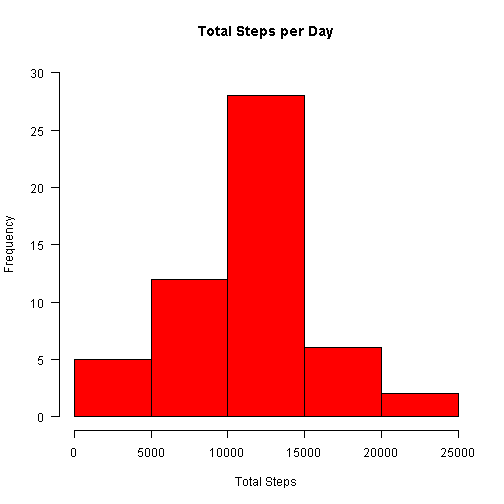
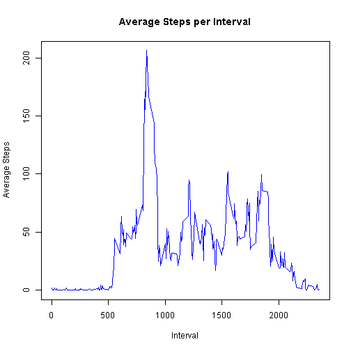
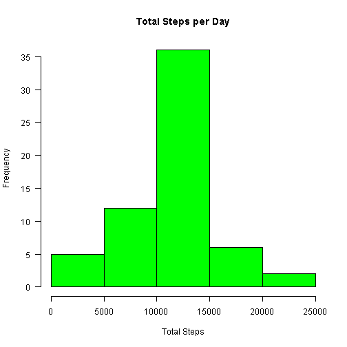
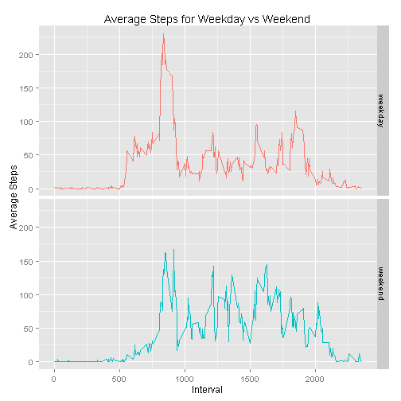

This markdown file is for Peer Assignment 1 for the Reproducible Research Coursera Course.

## Loading and preprocessing the data

Unzip the data file and load the data. Create a subset of data without NAs.


```r
unzip("activity.zip")
activity<-read.csv("activity.csv")
activity_comp<-activity[!is.na(activity$steps),]
```

## What is mean total number of steps taken per day?

Summarize total steps per day and create a histogram of total steps per day.


```r
total_steps<-aggregate(activity_comp$steps,by=list(date=activity_comp$date),FUN=sum)
hist(total_steps$x,main="Total Steps per Day",ylim=c(0,30), xlab="Total Steps",las=1,border="black",col="red")
```

 

Calculate mean total steps per day.


```r
mean(total_steps[,2])
```

```
## [1] 10766.19
```

Calculate median total steps per day.


```r
median(total_steps[,2])
```

```
## [1] 10765
```


## What is the average daily activity pattern?

Calculate average steps per interval over all days and plot data in line chart.


```r
avg_steps<-aggregate(activity_comp$steps,by=list(interval=activity_comp$interval),FUN=mean)
plot(avg_steps$interval,avg_steps$x,type="l",xlab="Interval",ylab="Average Steps",main="Average Steps per Interval",col="blue")
```

 

Calculate maximum average steps per interval and corresponding interval.


```r
avg_steps[which(avg_steps$x==max(avg_steps$x)),]
```

```
##     interval        x
## 104      835 206.1698
```

The max average steps is 206.2 and corresponding interval is 835.

## Imputing missing values

Calculate total rows with NAs


```r
sum(is.na(activity$steps))
```

```
## [1] 2304
```

Impute missing values by calculating average steps per interval and create a new dataset "merged_activity" by replacing NAs with average for given interval.


```r
avg_steps<-aggregate(activity$steps,by=list(interval=activity$interval),FUN=mean,na.rm=TRUE)
merged_activity<-merge(activity,avg_steps,"interval")
merged_activity$steps[is.na(merged_activity$steps)]<-merged_activity$x[is.na(merged_activity$steps)]
```

Calculate total steps per day for merged_data and create histogram.


```r
total_steps1<-aggregate(merged_activity$steps,by=list(date=merged_activity$date),FUN=sum)
hist(total_steps1$x,main="Total Steps per Day", xlab="Total Steps",las=1,border="black",col="green")
```

 

Calculate mean total steps per day imputed data:


```r
mean(total_steps1[,2])
```

```
## [1] 10766.19
```

compared to mean of non-imputed data:


```r
mean(total_steps[,2])
```

```
## [1] 10766.19
```

Calculate median total steps per day of imputed data:


```r
median(total_steps1[,2])
```

```
## [1] 10766.19
```

compared to median of non-imputed data:


```r
median(total_steps[,2])
```

```
## [1] 10765
```

The impact of imputing data in this manner is minimal for the mean and median total number of steps!

## Are there differences in activity patterns between weekdays and weekends?

Create weekday/weekend factor based on the date column in the imputed data.


```r
merged_activity$weekdays<-weekdays(as.Date(merged_activity$date,'%Y-%m-%d'))
merged_activity$weekdays<-factor(merged_activity$weekdays)
levels(merged_activity$weekdays)<-list("weekday"=c("Monday","Tuesday","Wednesday","Thursday","Friday"),"weekend"=c("Saturday","Sunday"))
```

Calculate average steps per interval over all weekdays and weekends and plot line charts in ggplot.


```r
avg_steps1<-aggregate(merged_activity$steps,by=list(interval=merged_activity$interval,weekday=merged_activity$weekday),FUN=mean,na.rm=TRUE)
names(avg_steps1)=c("interval","weekday","avg_steps")

library(ggplot2)
ggplot(data=avg_steps1,aes(x=interval,y=avg_steps,color=factor(weekday)))+geom_line()+facet_grid(weekday~.)+labs(x="Interval",y="Average Steps",title="Average Steps for Weekday vs Weekend")+theme(legend.position="none")
```

 
